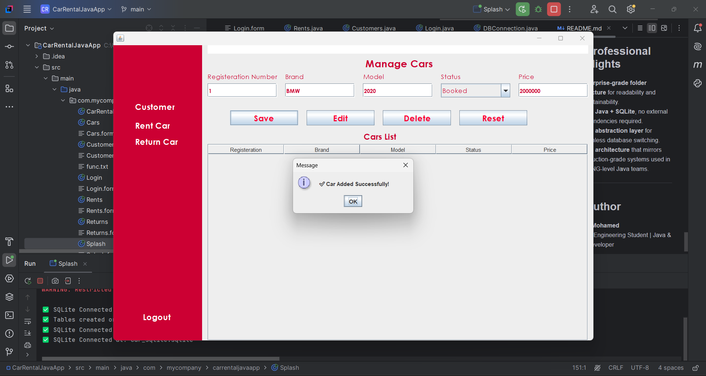

# 🚗 Car Rental Management System

## 🧠 Overview


**Car Rental Management System** is a modern, desktop-based Java application built using **Java Swing** and **SQLite**.  
It provides a full-featured solution for managing car rentals, customers, and transactions — all within a standalone, offline-capable application.

The project follows a **layered architecture (MVC + DAO)** design, ensuring scalability, maintainability, and clean code separation between the UI, business logic, and data layers.

---

## 🏗️ Project Architecture
```
src/
│
├── database/           # Database connection and setup
│   ├── DBConnection.java
│   └── DatabaseSetup.java
│
├── models/             # Plain Java objects (entities)
│   ├── Car.java
│   ├── Customer.java
│   └── Rental.java
│
├── dao/                # Data Access Objects (CRUD + queries)
│   ├── CarDAO.java
│   ├── CustomerDAO.java
│   └── RentalDAO.java
│
├── ui/                 # Graphical User Interface (Swing-based)
│   ├── Login.java
│   ├── Cars.java
│   ├── ManageCars.java
│   ├── Customer.java
│   └── MainDashboard.java
│
└── Main.java           # Entry point of the application
```

---

## ⚙️ Tech Stack
| Layer | Technology | Description |
|-------|-------------|-------------|
| **Frontend (UI)** | Java Swing | Interactive, responsive, and modern user interface |
| **Backend Logic** | Java OOP (MVC) | Clean separation of concerns and reusable components |
| **Database** | SQLite | Lightweight, file-based database for portability |
| **Design Pattern** | DAO + MVC | Structured and enterprise-grade software design |

---

## 🧩 Core Features
✅ **Authentication System** – Secure login form with input validation.  
✅ **Car Management** – Add, edit, delete, and view car listings.  
✅ **Customer Management** – Register and track customer details.  
✅ **Rental Operations** – Rent/return cars with automated availability updates.  
✅ **SQLite Integration** – Data stored locally (no server required).  
✅ **Dark/Light UI Theme** – Professional, clean, and user-friendly interface.  
✅ **Scalable Architecture** – Ready for transition to MySQL, PostgreSQL, or Cloud DBs.

---

## 🧠 Architecture Flow
**MVC + DAO Pattern** ensures maintainable and testable code:

```
UI Layer (Swing)  <-->  DAO Layer (SQLite Queries)
        ↓                     ↓
     Models (POJO)     <-->  Database
```

Each module is **loosely coupled**, allowing independent updates or database migration with minimal code changes.

---

## 💡 Example Database Tables
| Table | Columns |
|--------|----------|
| **cars** | id, brand, model, price_per_day, available |
| **customers** | id, name, phone, email |
| **rentals** | id, car_id, customer_id, rent_date, return_date, total_price |

---

## 🚀 How to Run
1. **Clone the Repository**
   ```bash
   git clone https://github.com/ibrahimMohamed124/CarRentalJavaApp
   cd CarRentalSystem
   ```

2. **Open in IntelliJ IDEA / NetBeans / Eclipse**

3. **Ensure SQLite Database Path Exists**
   ```text
   car_sqlite.sqlite
   ```
   *(Created automatically on first launch if it doesn’t exist.)*

4. **Run the Application**
   ```bash
   Main.java
   ```

---

## 🔒 Database Configuration
Located in:  
`src/database/DBConnection.java`

```java
String path = "car_sqlite.sqlite";
Connection conn = DriverManager.getConnection("jdbc:sqlite:" + path);
```

You can modify the path for different environments.  
The system will auto-connect and initialize required tables via `DatabaseSetup.java`.

---

## 🎨 UI Overview
- **Login Page** – Secure access for staff or admins
- **Dashboard** – Central hub for navigation
- **Manage Cars** – Table view with row selection → autofill form fields
- **Customer Panel** – Manage clients and history
- **Rental Panel** – Rent and return workflows

---

## 🧰 Future Enhancements
- [ ] Cloud synchronization (Firebase / AWS RDS)
- [ ] Real-time notifications
- [ ] Invoice generation (PDF export)
- [ ] Role-based authentication (Admin / Staff)
- [ ] Analytics dashboard using JavaFX or React front-end

---

## 💼 Professional Highlights
- **Enterprise-grade folder structure** for readability and maintainability.
- **Pure Java + SQLite**, no external dependencies required.
- **DAO abstraction layer** for seamless database switching.
- **MVC architecture** that mirrors production-grade systems used in FAANG-level Java teams.

---

## 👨‍💻 Author
**Ibrahim Mohamed**  
Software Engineering Student | Software Engineer
📍 Egypt  
🌐 [GitHub Profile](https://github.com/ibrahimMohamed124)
